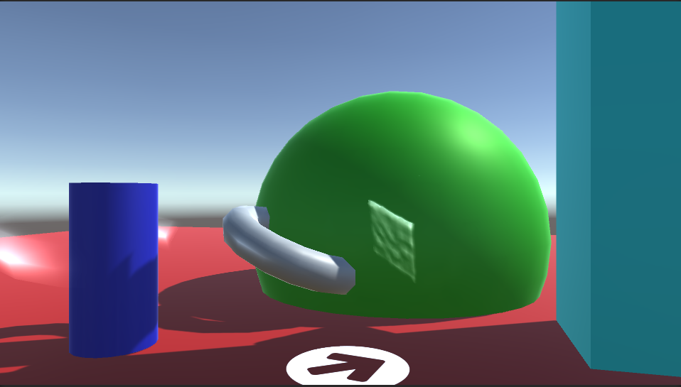
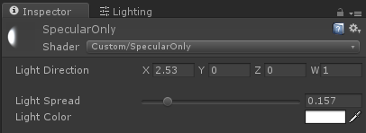

# Unity3D Specular Fake

This repository provides two shaders to face a specularity effect from a non-existing directional light. Useful for low-performance environments or other special effects. 

The demo scene contains three objects with the effect. 

* A transparent torus [Assets/SpecularOnly.shader](Assets/SpecularOnly.shader)
* A transparent and rough cube [Assets/SpecularOnly.shader](Assets/SpecularOnly.shader)
* A solid torus [Assets/Specular.shader](Assets/Specular.shader)

The arrow on the bottom of the screen displays the direction given as an input to the shader. A specular effect occurs on the (otherwise invisible) torus around the blue cylinder. This shader renders additively and only the specular effect is rendered. 

The grey torus partially inside the green spheer also has two specular effects. The first one is caused by the lighting situation surrounding it. The one on the left however is triggered by the custom direction input into the shader. 

The bumpy face on the green sphere is part of a (otherwise invisible) cube. The cube was subdivied multiple times and displaced with a cloud texture.   

1. _Light Direction_ is a Vector and should be mapped to the forward vector of the faked light.
2. _Light Spread_ describes the size of the specular effect
3. _Light Color_ the color of the specular effect

